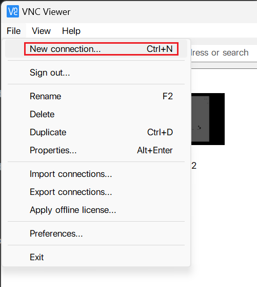
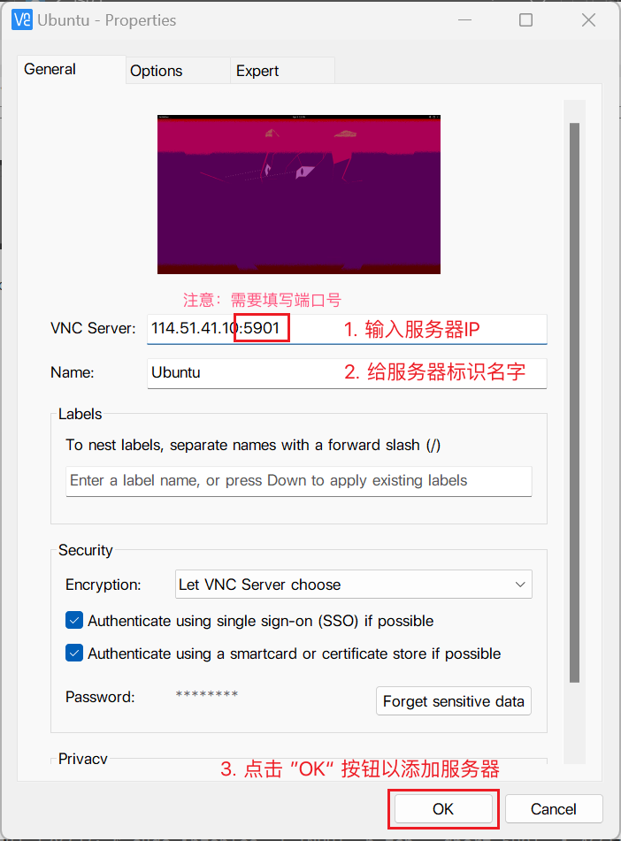
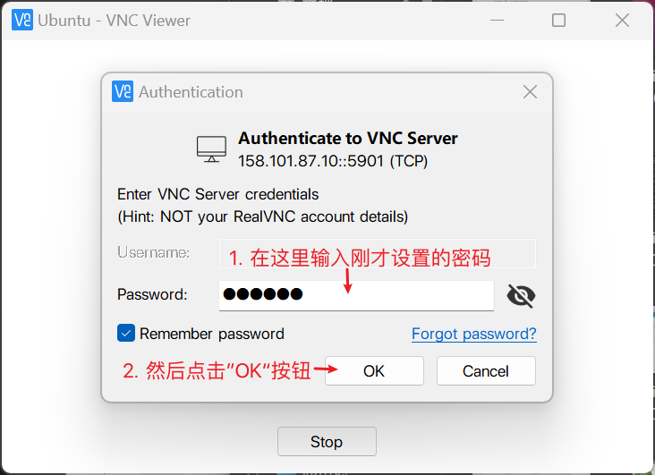
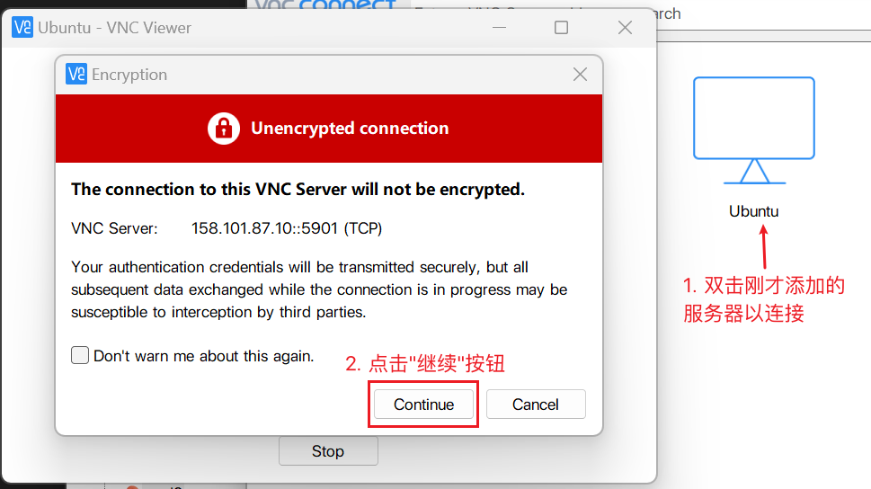
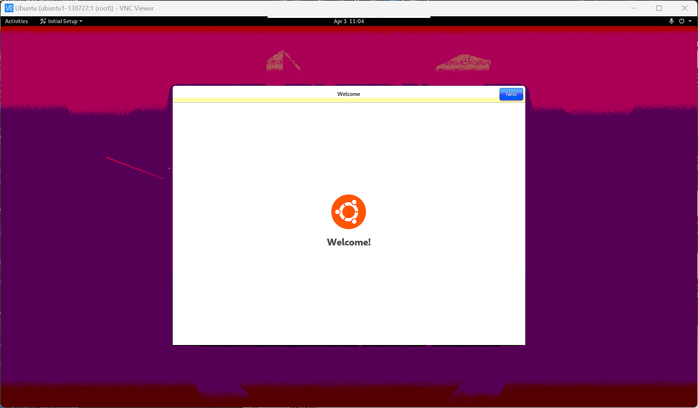
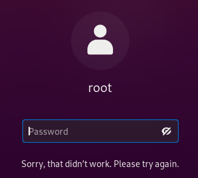

# 在 Ubuntu 服务器上安装并连接图形化界面
## 准备
- - -
+ 配置达标的服务器
+ 连接服务器终端的工具（比如 [Xshell](https://www.xshell.com/xshell-download/)）
+ 连接远程桌面的软件（比如 [VNC Viewer](https://www.realvnc.com/connect/download/viewer/)）
+ 确保服务器远程桌面端口可以被连接
## 过程
- - -
### 安装 GNOME 桌面环境并开启 VNC 服务器
在 Ubuntu 20.04.5 LTS 上操作 
1. 更新软件源并安装 GNOME 桌面环境。  
安装需要花一段时间，等待下载完成。
```
sudo apt-get update
sudo apt-get install ubuntu-gnome-desktop
```

2. 安装 VNC 服务器
```
sudo apt-get install tigervnc-standalone-server
```

3. 放行 5901 端口（同时还可能需要去服务器供应商的控制台将这个端口放行）
```
sudo iptables -I INPUT -p tcp --dport 5901 -j ACCEPT
```

4. 启动 VNC 服务器。  
```
sudo vncserver -localhost no -geometry 1920x1080 :1
```
+ 第一次运行需要设置密码，你需要记住设置的密码，之后连接的时候会用到。  
+ 出现类似 "New '_name_:1 (root)' desktop at :1 on machine _name_" 的消息即启动成功。


### 使用 VNC Viewer 连接服务器  
1. 添加服务器  
  
  
2. 连接服务器（如果连接不上则需要检查端口是否放行，以及IP地址与端口号是否正确）  
  
  
  
至此已经可以连接成功，但是仍然还有问题存在，比如在登录界面输入正确的密码却总是提示密码错误，那么就需要一些额外的操作来解决这个问题。

## 额外操作  
- - -  
* ### 登录界面输入正确密码总提示密码错误  
> 需要分别运行下面两条命令，并注释特定的行。  
  
  

  
1. `sudo vi /etc/pam.d/gdm-autologin`  
注释行 "auth requied pam_succeed_if.so user != root quiet success"

2. `sudo vi /etc/pam.d/gdm-password`  
注释行 "auth requied pam_succeed_if.so user != root quiet success"


## 参考  
- - -
1. [Linux服务器安装图形化界面——远程可视化](https://www.cnblogs.com/catblogs/p/13460040.html) （原始内容[存档](https://web.archive.org/web/20240601072629/https://www.cnblogs.com/catblogs/p/13460040.html)于2024-06-01）
2. [Ubuntu系的Linux使用vnc报错_ubuntu18.4 xterm不存在_好烦吃不胖的博客-CSDN博客](https://blog.csdn.net/chen462488588/article/details/112237950)  (原始内容[存档](https://web.archive.org/web/20211107023521/https://blog.csdn.net/chen462488588/article/details/112237950)于2021-11-07）
